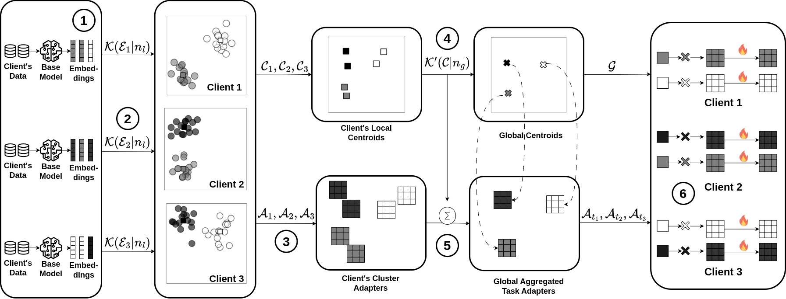

# FedRouter

# Task-Centric Personalized Federated Fine-Tuning of Language Models

## Abstract
 Federated Learning (FL) has emerged as a promising technique for training language models on distributed and private datasets of diverse tasks. However, aggregating models trained on heterogeneous tasks often degrades the overall performance of individual clients. To address this issue, Personalized FL (pFL) aims to create models tailored for each client’s data distribution. Although these approaches improve local performance, they usually lack robustness in two aspects: (i) generalization: when clients must make predictions on unseen tasks, or face changes in their data distributions, and (ii) intra-client tasks interference: when a single client's data contains multiple distributions that may interfere with each other during local training. To tackle these two challenges, we propose FedRouter, a clustering-based pFL that builds specialized models for each task rather than for each client. FedRouter uses adapters to personalize models by employing two clustering mechanisms to associate adapters with specific tasks. A local clustering that associate adapters with task data samples and a global one that associates similar adapters from different clients to construct task-centric personalized models. Additionally, we propose an evaluation router mechanism that routes test samples to the best adapter based on the created clusters. Experiments comparing our method with existing approaches across a multitask dataset, FedRouter demonstrate strong resilience in these challenging scenarios performing up to 6.1% relatively better under tasks interference and up to 136% relative improvement under generalization evaluation




## Repository Overview
This repository contains code for running federated fine-tuning experiments with task-centric personalized and clustered federated learning setups using [Flower Framework](https://flower.ai/). Code adapted from [OpenFedLLM](https://github.com/rui-ye/OpenFedLLM).

## Quick Start
1. Create and activate a Python environment.
2. Install dependencies.
3. Run the simulation script.

```bash
python -m venv .venv
source .venv/bin/activate
pip install -r requirements.txt
```

## How To Run
The default launcher is:

```bash
sh training_scripts/run_flower_simulation_router.sh
```

The script loops over multiple seeds and writes one log per seed to `output_dir`.

## Configure `run_flower_simulation_router.sh`
Edit variables at the top of `training_scripts/run_flower_simulation_router.sh`.

### Training Configuration
- `max_steps` (default: `10`): Max optimizer update steps per local training call.
- `num_train_epochs` (default: `1`): Number of local training epochs per round.
- `num_rounds` (default: `25`): Number of federated communication rounds.
- `eval_round` (default: `"3,10,25,50,75,100"`): Comma-separated rounds where evaluation is triggered.
- `batch_size` (default: `16`): Per-device training batch size.
- `batch_size_eval` (default: `128`): Evaluation batch size.
- `gradient_accumulation_steps` (default: `1`): Accumulate gradients across this many steps.
- `seq_length` (default: `1024`): Max sequence length for tokenization/training.
- `num_clients` (default: `8`): Total number of federated clients.
- `sample_clients` (default: `8`): Number of clients sampled each round.
- `lora_r` (default: `8`): LoRA rank.
- `lora_alpha` (default: `16`): LoRA scaling factor.
- `lr` (default: `5e-4`): Learning rate.

### Dataset Configuration
- `dataset_name` (default: `"multitask"`): Dataset identifier expected by dataset utilities.
- `dataset_sample` (default: `400000`): Number of examples sampled/processed.

### Model Configuration
- `model_name_or_path` (default: `"meta-llama/Llama-3.2-1B"`): Base model path or Hugging Face model id.
- `seeds` (default: `"111 222 333 444 555"`): Space-separated random seeds. One run is executed per seed.

### Output Configuration
- `output_dir` (default: `"outpu_multitask/experiments_1b"`): Directory for checkpoints, logs, and simulation outputs.
- `sim_alias` (default: `"router_single"`): Prefix used in run names and log filenames (it will be timestamped also).

### FedRouter Configuration
- `fed_alg` (default: `"clustered"`): Federated algorithm selection.
- `n_clusters` (default: `1`): Number of local/client-side clusters.
- `global_n_clusters` (default: `4`): Number of global federation clusters.
- `split_strategy` (default: `"multitask_clusters"`): Dataset splitting strategy across clients.
- `train_split` (default: `0.8`): Fraction of data used for training.
- `evaluation_mode` (default: `"local"`): Evaluation routing mode (`local` or `global`).

### Hardware and Resources
- `gpu` (default: `"0"`): Value exported to `CUDA_VISIBLE_DEVICES`.
- `client_resources_cpus` (default: `1`): CPU resources assigned per client.
- `client_resources_gpus` (default: `1`): GPU resources assigned per client.

## Notes
- The launcher passes `--use_peft True` and `--load_in_4bit True` by default.
- To run fewer seeds, set `seeds` to a shorter list (for example: `"111"`).
- Log files are saved as `${sim_alias}_seed${seed}_log.txt` inside `output_dir`.


## Citation

```bibtex
@article{talasso2026task,
  title={Task-Centric Personalized Federated Fine-Tuning of Language Models},
  author={Talasso, Gabriel U and Kurmanji, Meghdad and de Souza, Allan M and Lane, Nicholas D and Villas, Leandro A},
  journal={arXiv preprint arXiv:2604.00050},
  year={2026}
}
```
